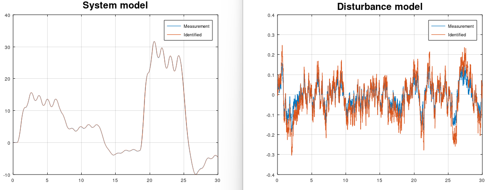

# MataveID V17.0.0
MataveID is a basic system identification toolbox for both GNU Octave and MATLAB®. MataveID is based on the power of linear algebra and the library is easy to use. MataveID using the classical realization and polynomal theories to identify state space models from data. There are lots of subspace methods in the "old" folder and the reason why I'm not using these files is because they can't handle noise quite well. 

I'm building this library because I feel that the commercial libraries are just for theoretical experiments. I'm focusing on real practice and solving real world problems. 


# Papers:
MataveID contains realization identification, polynomal algorithms and subspace algorithms. They can be quite hard to understand, so I highly recommend to read papers in the "reports" folder about the algorithms if you want to understand how they work, or read the literature.

# Literature:
I have been using these books for creating the `.m` files. All these books have different audience. Some techniques are meant for researchers and some are meant for practical engineering.

### Applied System Identification
This book include techniques for linear mechanical systems such as vibrating beams, damping, structural mechanics etc. These techniques comes from NASA and the techniques are created by `Jer-Nan Juang`. This is a very practical book. The book uses the so called realization theory methods for identify dynamical models from data. 

Advantages:
 - Easy to read and very practical
 - Include mechanical model buildning
 - Include impulse, frequency, stochastic, closed loop and recursive identification
 - These techniques are applied onto Hubble Telescope, Space Shuttle Discovery and Galileo spacecraft
 
Disadvantages:
 - Do not include nonlinear system identification and subspace methods
 - Do not include filtering
 - MATLAB files from this book is export controlled from NASA = Difficult to download
 - This book is not produced anymore. I have the PDF.


### System Modeling & Identification
This book covering techniques for all types of systems, linear and nonlinear, but it's more a general book for system identfication. `Professor Rolf Johansson` book contains lots of practice, but also theory as well. More theory and less practice compared to `Applied System Identification` from `Jer-Nan Juang`. This book uses both the realization theory methods and subspace methods for identify dynamical systems from data. Also this book includes filters as well such as Uncented Kalman Filter. Can be purchased from https://kfsab.se/sortiment/system-modeling-and-identification/ 

Advantages:
 - Easy to read and somtimes practical
 - Include filtering, statistics and other types of modeling techniques
 - Include impulse, frequency, stochastic, closed loop, nonlinear and recursive identification
 - Include both realization theory, subspace and nonlinear system identification methods
 
Disadvantages:
 - Do not include closed loop identification
 - Some methods are difficult to understand how to apply with MATLAB-code. Typical univerity literature for students


### Subspace Methods For System Identification
This book include techniques for all types of linear systems. It's a general book of linear system identification. The advantages of this book is that it include modern system identification techniques. The disadvantages about this book is that it contains only theory and no practice, but `Professor Tohru Katayama`, have made a great work for collecting all these subspace methods. Use this book if you want to have knowledge about the best subspace identification methods.

Advantages:
 - Include MATLAB code examples and lots of step by step examples
 - Include stochastic and closed identification
 - Include the latest methods for linear system identification
 - Include both realization theory and subspace system identification methods
 
Disadvantages:
 - Difficult to read and understand
 - Does not include impulse, frequency and nonlinear identification
 - Does not include filtering, statistics and other types of modeling techniques


### Adaptive Control
This book is only for adaptive control. But there is one algorithm that are very useful - Recursive Least Squares. This is a very pratical book for applied adaptive control. It's uses the legacy SISO adaptive techniques such as pole placement, Self Tuning Regulator(STR) and Model Reference Adaptive Systems(MRAS) combined with Recursive Least Squares(RLS). If you wonder why only SISO and not MIMO, it's because adaptive control is very difficult to apply in practice and create a reliable controller for all types of systems. The more difficult problem is to solve, the more simplier technique need to be used.

Advantages:
 - The authors of the book explains which chapters are for pratcial engineering and theoretical researchers
 - Easy to read 
 - Include both advanced and simple methods depending on which type of problem to solve

Disadvantages:
 - Only one system identification algorithm is taught
 - Only SISO model are applied
 - This book is made for adaptive control and have only one chapter that contains system identification


# Examples

## BJ - Box-Jenkins
Box-Jenkins is a special case when a system model `sysd` and a disturbance model `sysh` need to be found. The disturbance is difficult to know and with this Box-Jenkins algorithm, then the user can identify the disturbance model and create an observer of it by using the kalman gain matrices `K1, K2`. Notice that this Box-Jenkins algorithm using subspace methods, instead of classical polynomial methods.

The disturbance model can be used for:
* Create a disturbance simulation with feedback control 
* Create filtering for sensors

```matlab
[sysd, K1, sysh, K2] = mi.bj(u, y, k, sampleTime, ktune, delay, systemorder_sysd, systemorder_sysh);
```

## Example
https://github.com/DanielMartensson/MataveID/blob/328f7f5cb3a0ad32619968d9babb3126772c4ca3/examples/bjExample.m#L1-L50


## Results



# Install
To install MataveID, download the folder "matave" and place it where you want it. Then the following code need to be written inside of the terminal of your MATLAB® or GNU Octave program. 

```matlab
path('path/to/the/folder/matave', path)
savepath
```
Example of a typical path.

```matlab
path('C:\Users\dmn\Documents\Octave\matave\', path)
savepath
```

Package requriments: 

 - [MataveControl](https://github.com/DanielMartensson/matavecontrol) package.

# Update
Write this inside the terminal. Then MataveID is going to download new .m files to MataveID from GitHub

```matlab
mi.updatemataveid
```
