# MataveID V17.0.0
MataveID is a basic system identification toolbox for both GNU Octave and MATLAB®. MataveID is based on the power of linear algebra and the library is easy to use. MataveID using the classical realization and polynomal theories to identify state space models from data. There are lots of subspace methods in the "old" folder and the reason why I'm not using these files is because they can't handle noise quite well. 

I'm building this library because I feel that the commercial libraries are just for theoretical experiments. I'm focusing on real practice and solving real world problems. 


# Papers:
MataveID contains realization identification, polynomal algorithms and subspace algorithms. They can be quite hard to understand, so I highly recommend to read papers in the "reports" folder about the algorithms if you want to understand how they work, or read the literature.

# Literature:
I have been using these books for creating the `.m` files. All these books have different audience. Some techniques are meant for researchers and some are meant for practical engineering.

### Applied System Identification
This book include techniques for linear mechanical systems such as vibrating beams, damping, structural mechanics etc. These techniques comes from NASA and the techniques are created by `Jer-Nan Juang`. This is a very practical book. The book uses the so called realization theory methods for identify dynamical models from data. 

Advantages:
 - Easy to read and very practical
 - Include mechanical model buildning
 - Include impulse, frequency, stochastic, closed loop and recursive identification
 - These techniques are applied onto Hubble Telescope, Space Shuttle Discovery and Galileo spacecraft
 
Disadvantages:
 - Do not include nonlinear system identification and subspace methods
 - Do not include filtering
 - MATLAB files from this book is export controlled from NASA = Difficult to download
 - This book is not produced anymore. I have the PDF.


### System Modeling & Identification
This book covering techniques for all types of systems, linear and nonlinear, but it's more a general book for system identfication. `Professor Rolf Johansson` book contains lots of practice, but also theory as well. More theory and less practice compared to `Applied System Identification` from `Jer-Nan Juang`. This book uses both the realization theory methods and subspace methods for identify dynamical systems from data. Also this book includes filters as well such as Uncented Kalman Filter. Can be purchased from https://kfsab.se/sortiment/system-modeling-and-identification/ 

Advantages:
 - Easy to read and somtimes practical
 - Include filtering, statistics and other types of modeling techniques
 - Include impulse, frequency, stochastic, closed loop, nonlinear and recursive identification
 - Include both realization theory, subspace and nonlinear system identification methods
 
Disadvantages:
 - Do not include closed loop identification
 - Some methods are difficult to understand how to apply with MATLAB-code. Typical univerity literature for students


### Subspace Methods For System Identification
This book include techniques for all types of linear systems. It's a general book of linear system identification. The advantages of this book is that it include modern system identification techniques. The disadvantages about this book is that it contains only theory and no practice, but `Professor Tohru Katayama`, have made a great work for collecting all these subspace methods. Use this book if you want to have knowledge about the best subspace identification methods.

Advantages:
 - Include MATLAB code examples and lots of step by step examples
 - Include stochastic and closed identification
 - Include the latest methods for linear system identification
 - Include both realization theory and subspace system identification methods
 
Disadvantages:
 - Difficult to read and understand
 - Does not include impulse, frequency and nonlinear identification
 - Does not include filtering, statistics and other types of modeling techniques


### Adaptive Control
This book is only for adaptive control. But there is one algorithm that are very useful - Recursive Least Squares. This is a very pratical book for applied adaptive control. It's uses the legacy SISO adaptive techniques such as pole placement, Self Tuning Regulator(STR) and Model Reference Adaptive Systems(MRAS) combined with Recursive Least Squares(RLS). If you wonder why only SISO and not MIMO, it's because adaptive control is very difficult to apply in practice and create a reliable controller for all types of systems. The more difficult problem is to solve, the more simplier technique need to be used.

Advantages:
 - The authors of the book explains which chapters are for pratcial engineering and theoretical researchers
 - Easy to read 
 - Include both advanced and simple methods depending on which type of problem to solve

Disadvantages:
 - Only one system identification algorithm is taught
 - Only SISO model are applied
 - This book is made for adaptive control and have only one chapter that contains system identification


# Examples

## Multivariable Output-Error State Space
MOESP is an algorithm that identify a linear state space model. It was invented in 1992. It can both identify SISO and MISO models.
Try MOESP or N4SID. They give the same result, but sometimes MOESP can be better than N4SID. It all depends on the data.

```matlab
[sysd] = mi.moesp(u, y, k, sampleTime, delay, systemorder); % k = Integer tuning parameter such as 10, 20, 25, 32, 47 etc.
```

## Example MOESP
https://github.com/DanielMartensson/MataveID/blob/39c9b1b9d4361b880f1773b82764bd549c943f5d/examples/moespExample.m#L1-L22


# RLS - Recursive Least Squares
RLS is an algorithm that creates a SISO model from data. Here you can select if you want to estimate an ARX, OE model or an ARMAX model, depending on the number of zeros in the polynomal "nze". Select number of error-zeros-polynomal "nze" to 1, and you will get a ARX model or select "nze" equal to model poles "np", you will get an ARMAX model that also includes a kalman gain matrix K. I recommending that. This algorithm can handle data with noise. This algorithm was invented 1821 by Carl Friedrich Gauss, but it was until 1950 when it got its attention in adaptive control.

Use this algorithm if you have data from a open/close loop system and you want to apply that algorithm into embedded system that have low RAM and low flash memory. RLS is very suitable for system that have a lack of memory.

There is a equivalent C-code for RLS algorithm here. Works on ALL embedded systems.
https://github.com/DanielMartensson/CControl

```matlab
[sysd, K] = mi.rls(u, y, np, nz, nze, sampleTime, delay, forgetting);
```

Notice that there are sevral functions that simplify the use of `rls.m`

```matlab
[sysd, K] = mi.oe(u, y, np, nz, sampleTime, delay, forgetting);
[sysd, K] = mi.arx(u, y, np, nz, sampleTime, ktune, delay, forgetting);
[sysd, K] = mi.armax(u, y, np, nz, nze, sampleTime, ktune, delay, forgetting);
```

## Example RLS

This is a hanging load of a hydraulic system. This system is a linear system due to the hydraulic cylinder that lift the load. Here I create two linear first order models. One for up lifting up and one for lowering down the weight. I'm also but a small orifice between the outlet and inlet of the hydraulic cylinder. That's create a more smooth behavior. Notice that this RLS algorithm also computes a Kalman gain matrix.


https://github.com/DanielMartensson/MataveID/blob/2014b74a0863729b43e0ee02ecdcd4fcbc06b26b/examples/rlsExample.m#L1-L60

Here we can se that the first model follows the measured position perfect. The "down-curve" should be measured a little bit longer to get a perfect linear model.

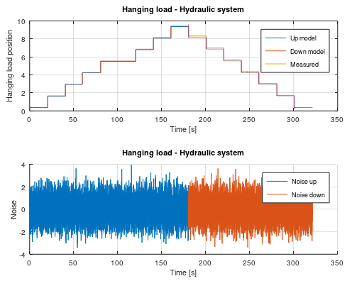

## SINDy - Sparse Identification of Nonlinear Dynamics
This is a new identification technique made by [Eurika Kaiser](https://github.com/eurika-kaiser) from University of Washington. It extends the identification methods of grey-box modeling to a much simplier way. This is a very easy to use method, but still powerful because it use least squares with sequentially thresholded least squares procedure. I have made it much simpler because now it also creates the formula for the system. In more practical words, this method identify a nonlinear ordinary differential equations from time domain data.

This is very usefull if you have heavy nonlinear systems such as a hydraulic orifice or a hanging load. 

```matlab
[dx] = mi.sindy(inputs, outputs, degree, lambda, sampleTime);
```

## SINDy Example

This example is a real world example with noise and nonlinearities. Here I set up a hydraulic motor in a test bench and measure it's output and the current to the valve that gives the motor oil. The motor have two nonlinearities - Hysteresis and the input signal is not propotional to the output signal. By using two nonlinear models, we can avoid the hysteresis. 


https://github.com/DanielMartensson/MataveID/blob/2014b74a0863729b43e0ee02ecdcd4fcbc06b26b/examples/sindyExample.m#L1-L45


## Square Root Uncented Kalman Filter for parameter estimation
This is Uncented Kalman Filter that using cholesky update method (more stable), instead of cholesky decomposition. This algorithm can estimate parameters to very a complex function if data is available. This method is reqursive and there is a C code version in CControl as well. Use this when you need to estimate parameters to a function if you have data that are generated from that function. It can be for example an object that you have measured data and you know the mathematical formula for that object. Use the measured data with this algorithm and find the parameters for the formula.

```matlab
[Sw, what] = mi.sr_ukf_parameter_estimation(d, what, Re, x, G, lambda_rls, Sw, alpha, beta, L);
```

## Square Root Uncented Kalman Filter for parameter estimation example
https://github.com/DanielMartensson/MataveID/blob/2014b74a0863729b43e0ee02ecdcd4fcbc06b26b/examples/sr_ukf_parameter_estimationExample.m#L1-L62


## Square Root Uncented Kalman Filter for state estimation
This is Uncented Kalman Filter that using cholesky update method (more stable), instead of cholesky decomposition. This algorithm can estimate states from a very complex model. This method is reqursive and there is a C code version in CControl as well. Use this when you need to estimate state to a model if you have data that are generated from that function. It can be for example an object that you have measured data and you know the mathematical formula for that object. Use the measured data with this algorithm and find the states for the model.

```matlab
[S, xhat] = mi.sr_ukf_state_estimation(y, xhat, Rn, Rv, u, F, S, alpha, beta, L);
```

## Square Root Uncented Kalman Filter for state estimation example
https://github.com/DanielMartensson/MataveID/blob/2014b74a0863729b43e0ee02ecdcd4fcbc06b26b/examples/sr_ukf_state_estimationExample.m#L1-L68


## Numerical algorithm for Subspace State Space System IDentification.
N4SID is an algoritm that identify a linear state space model. Use this if you got regular data from a dynamical system. This algorithm can handle both SISO and MISO. N4SID algorithm was invented 1994. If you need a nonlinear state space model, check out the SINDy algorithm. Try N4SID or MOESP. They give the same result, but sometimes N4SID can be better than MOESP. It all depends on the data.

```matlab
[sysd, K] = mi.n4sid(u, y, k, sampleTime, ktune, delay, systemorder); % k = Integer tuning parameter such as 10, 20, 25, 32, 47 etc. ktune = kalman filter tuning such as 0.1, 0.01 etc
```
## Example N4SID

Here I programmed a Beijer PLC that controls the multivariable cylinder system. It's a nonlinear system, but N4SID can handle it because it's not so nonlinear as a hydraulic motor. Cylinder 0 and Cylinder 1 affecting each other when the propotional control valves opens.


https://github.com/DanielMartensson/MataveID/blob/4c18a134f9590a6a952d9c5b4710332d6482434d/examples/n4sidExample.m#L1-L45


# OCID - Observer Controller Identification
This is an extention from OKID. The idea is the same, but OCID creates a LQR contol law as well. This algorithm works only for closed loop data. It have its orgin from NASA around 1992 when NASA wanted to identify a observer, model and a LQR control law from closed loop data that comes from an actively controlled aircraft wing in a wind tunnel at NASA Langley Research Center. This algorithm works for both SISO and MIMO models.

Use this algorithm if you want to extract a LQR control law, kalman observer and model from a running dynamical system. Or if your open loop system is unstable and it requries some kind of feedback to stabilize it. Then OCID is the perfect choice.

This OCID algorithm have a particle filter that estimates the markov parameters.

```matlab
[sysd, K, L] = mi.ocid(r, uf, y, sampleTime, alpha, regularization, systemorder);
```


## OCID Example
https://github.com/DanielMartensson/MataveID/blob/2014b74a0863729b43e0ee02ecdcd4fcbc06b26b/examples/ocidExample.m#L1-L59

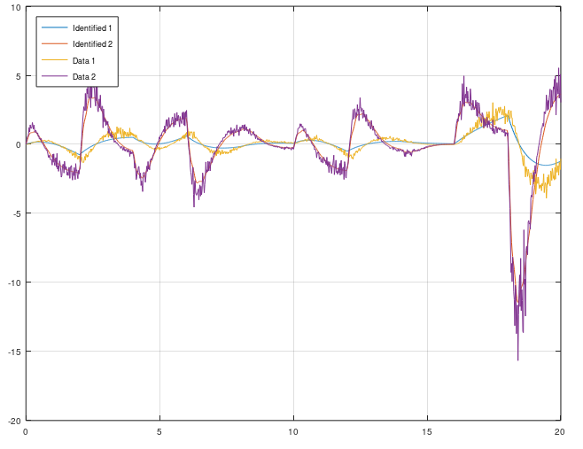

# Oriented FAST Rotated Pattern
Use this algorithm if you want to convert keypoints into one large binary matrix for image classification and detection.

```matlab
[data, X1, X2, G, corners, scores] = mi.orp(X, sigma1, sigma2, threshold_sobel, threshold_fast, fast_method);
```

## Example

https://github.com/DanielMartensson/MataveID/blob/a300c9e3507cb9806b9b5ff59770ca02eee9a0bb/examples/orpExample.m#L1-L37

## Results


## Sobel filter
Use this filter if you want to find the gradients and the orientations inside an image

```matlab
[G, O] = mi.sobel(image);
```

## Example

https://github.com/DanielMartensson/MataveID/blob/1fb031672ff69d67bdc297795498fef6665263d0/examples/sobelExample.m#L1-L23

## Result


## Particle Filter - Nonlinear filter
A particle filter is another estimation filter such as Square Root Uncented Kalman Filter (SR-UKF), but SR-UKF assume that the noise is gaussian (normally distributed) and SR-UKF requries a dynamical model. The particle filter does not require the user to specify a dynamical model and the particle filter assume that the noise can be non-gaussian or gaussian, nonlinear in other words.

The particle filter is using Kernel Density Estimation algorithm to create the internal probability model, hence the user only need to specify one parameter with the following example. If you don't have a model that describes the dynamical behaviour, this filter is the right choice for you then.

```matlab
[xhat, horizon, k, noise] = mi.pf(x, xhatp, k, horizon, noise);
```

## Particle Filter example 1
https://github.com/DanielMartensson/MataveID/blob/817443d34f783f393d8265c8b8c5cf0642ebda93/examples/particleFilterExample1.m#L1-L44


## Particle Filter example 2
https://github.com/DanielMartensson/MataveID/blob/817443d34f783f393d8265c8b8c5cf0642ebda93/examples/particleFilterExample2.m#L1-L32

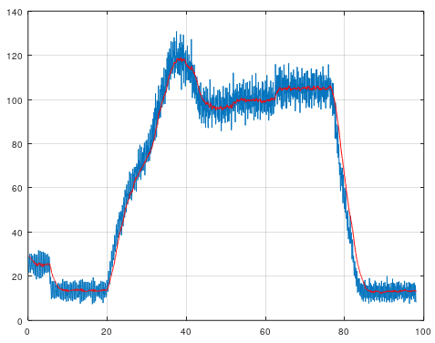

## BJ - Box-Jenkins
Box-Jenkins is a special case when a system model `sysd` and a disturbance model `sysh` need to be found. The disturbance is difficult to know and with this Box-Jenkins algorithm, then the user can identify the disturbance model and create an observer of it by using the kalman gain matrices `K1, K2`. Notice that this Box-Jenkins algorithm using subspace methods, instead of classical polynomial methods.

The disturbance model can be used for:
* Create a disturbance simulation with feedback control 
* Create filtering for sensors

```matlab
[sysd, K1, sysh, K2] = mi.bj(u, y, k, sampleTime, ktune, delay, systemorder_sysd, systemorder_sysh);
```

## Example
https://github.com/DanielMartensson/MataveID/blob/328f7f5cb3a0ad32619968d9babb3126772c4ca3/examples/bjExample.m#L1-L50


## Results


## Canny filter
Use this filter if you want to find the edges inside an image

```matlab
[E] = mi.canny(image);
```

## Example

https://github.com/DanielMartensson/MataveID/blob/210c93d528a0ebe7f6f59df54904a77cb529091f/examples/cannyExample.m#L1-L23

## Result
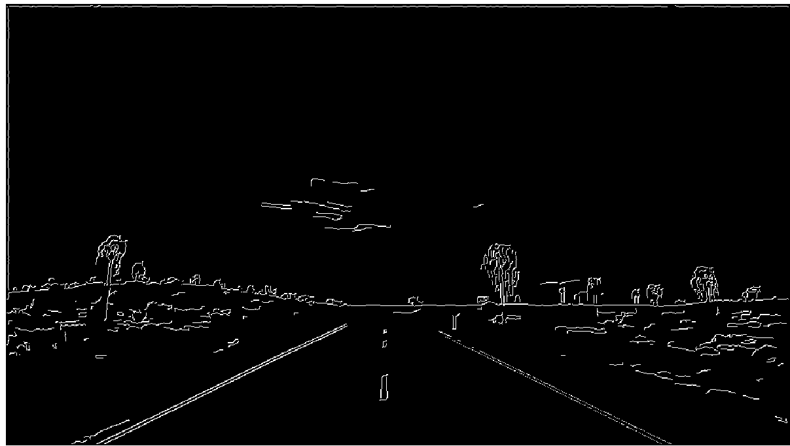

Notice that Canny is quite slow, but gives very thin edges, which is good. But if you only want to have the edges and you don't care how thick they are.
Then Sobel is the right solution for you because Sobel is much faster than Canny.

```matlab
>> G = mi.sobel(imread('way.jpg'));
>> G(G < 255) = 0; % Every pixel that are not white is going to be black
>> imshow(uint8(G));
```
## Result
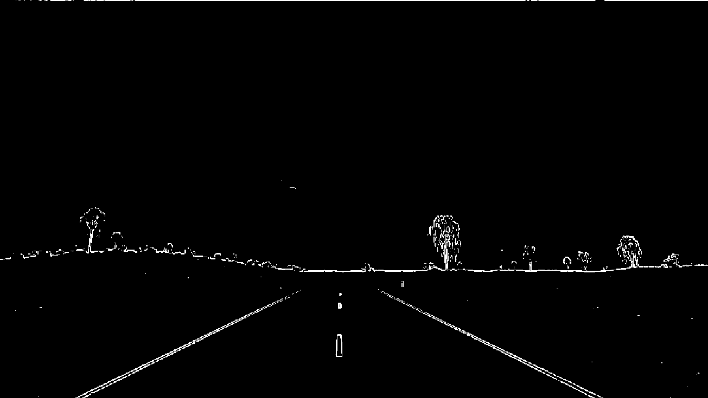

## Principal Component Analysis
Principal Component Analysis can be used for dimension reduction and projection on maximum variance between classes.

```matlab
[P, W, mu] = mi.pca(X, c);
```
## Principal Component Analysis example

https://github.com/DanielMartensson/MataveID/blob/48b6eaf69f061351e910877c131b6d3dde03ff31/examples/pcaExample.m#L1-L60


## CCA - Canonical Correlation Analysis
If N4SID won't work for you due to high noise measurement, then CCA is an alternative method to use. CCA returns a state space model and a kalman gain matrix K.

```matlab
[sysd, K] = mi.cca(u, y, k, sampleTime, delay); % k = Integer tuning parameter such as 10, 20, 25, 32, 47 etc.
```

## Example CCA
https://github.com/DanielMartensson/MataveID/blob/2014b74a0863729b43e0ee02ecdcd4fcbc06b26b/examples/ccaExample.m#L1-L38


## Density-based spatial clustering of applications with noise
This is a cluster algorithm that can identify the amount of clusters. 
This algorithm requries two tuning parameters, `epsilon` and `min_pts`, which stands for `radius` and `minimum points`.
This algorithm does not work if you have varying densities, else this algorithm is considered to be one of the best clustering algorithms.
So, make sure that all your classes have the same amount of variance before you are using this algorithm due to its robustness against noise/outliers.

It exist an equivalent C-code dbscan inside CControl repository. 

```matlab
[idx] = mi.dbscan(X, epsilon, min_pts);
```

## Example Density-based spatial clustering of applications with noise

https://github.com/DanielMartensson/MataveID/blob/7e1b828a4782826489139ea46defd12bec4c7c38/examples/dbscanExample.m#L1-L110

https://github.com/DanielMartensson/MataveID/blob/837fe5aa302134e3e68631e306ff2ef1ed683281/examples/dbscanNonGaussianExample.m#L1-L1035

## Results


## ERA/DC - Eigensystem Realization Algorithm Data Correlations
ERA/DC was invented 1987 and is a successor from ERA, that was invented 1985 at NASA. The difference between ERA/DC and ERA is that ERA/DC can handle noise much better than ERA. But both algorihtm works as the same. ERA/DC want an impulse response. e.g called markov parameters. You will get a state space model from this algorithm. This algorithm can handle both SISO and MISO data.

Use this algorithm if you got impulse data from e.g structural mechanics.

```matlab
[sysd, K] = mi.eradc(g, sampleTime, ktune, delay systemorder);
```
## Example ERA/DC for MIMO systems


https://github.com/DanielMartensson/MataveID/blob/2014b74a0863729b43e0ee02ecdcd4fcbc06b26b/examples/eradcExample.m#L1-L61


#Feature from accelerated segmentation test
Use Feature from accelerated segmentation test(FAST) if you want to find corners inside an image. There is also an equivalent C-code FAST algorithm inside the CControl repository.

```matlab
[corners, scores] = mi.fast(image, threshold, fast_method);
```

## Example
https://github.com/DanielMartensson/MataveID/blob/cbd69aeeb143e64511fed1c1db720d16c5ee92b1/examples/fastExample.m#L1-L20

## Result


## Filtfilt - Zero Phase Filter
This filter away noise with a good old low pass filter that are being runned twice. Filtfilt is equal to the famous function filtfilt in MATLAB, but this is a regular .m file and not a C/C++ subroutine. Easy to use and recommended. 

```matlab
[y] = mi.filtfilt(y, t, K);
```

## Filtfilt Example
https://github.com/DanielMartensson/MataveID/blob/2014b74a0863729b43e0ee02ecdcd4fcbc06b26b/examples/filtfiltExample.m#L1-L31


## Hough Transform
Use this algorithm if you want to find lines inside an edge image. Important that the image needs to be an edge image. 

```matlab
[N, K, M] = mi.hough(X, p, epsilon, min_pts);
```

## Hough Transform example

Assume that we have road that we want to track by writing two parallell lines that follows the road and we want to avoid everything else.

https://github.com/DanielMartensson/MataveID/blob/0152b6ba7be0c80007987bb68f0c88b9e7e8b499/examples/houghExample.m#L1-L30


## Independent Component Analysis
Independent component analysis(ICA) is a tool if you want to separate independent signals from each other. This is not a filter algorithm, but instead of removing noise, it separate the disturbances from the signals. The disturbances are created from other signals. Assume that you have an engine and you are measuring vibration in X, Y and Z-axis. These axis will affect each other and therefore the signals will act like they are mixed. ICA separate the mixed signals into clean and independent signals.

```matlab
[S] = mi.ica(X);
```
## Independent Component Analysis example

https://github.com/DanielMartensson/MataveID/blob/2014b74a0863729b43e0ee02ecdcd4fcbc06b26b/examples/icaExample.m#L1-L137

These signals are what we want to find


This is how the signals look when we are measuring them


This is how the signals are reconstructed as they were independent


## IDBode - Identification Bode
This plots a bode diagram from measurement data. It can be very interesting to see how the amplitudes between input and output behaves over frequencies. This can be used to confirm if your estimated model is good or bad by using the `bode` command from Matavecontrol and compare it with idebode.

```matlab
mi.idbode(u, y, w);
```

## IDBode Example


https://github.com/DanielMartensson/MataveID/blob/2014b74a0863729b43e0ee02ecdcd4fcbc06b26b/examples/idbodeExample.m#L1-L25

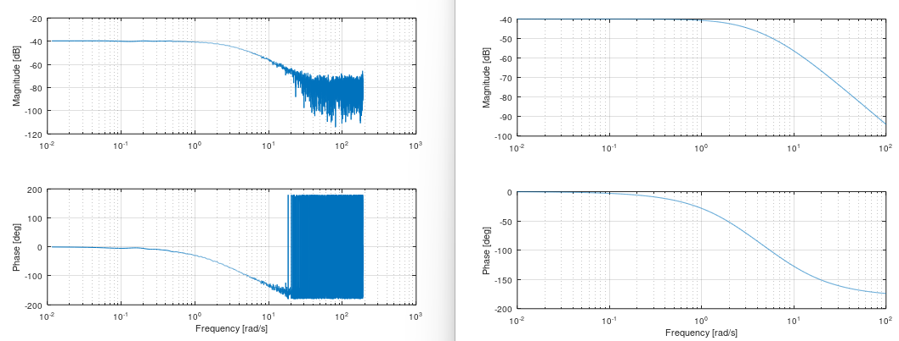

## Gaussian 2D filter
Use this filter if you want to blur an image

```matlab
[Y] = mi.imgaussfilt(image, sigma);
```

## Example

https://github.com/DanielMartensson/MataveID/blob/662c95dbef1eba3d9f061b73ce07342e2c50f96c/examples/imgaussfiltExample.m#L1-L26

## Result


## K-means clustering
K-means clustering is a tool that can identify the center of clusters. All you need to do is to specify how many cluster IDs you think there exist in your data. Use this algorithm if your data is gaussian and you know the numbers of clusters. All you want to know are the cetrums of the clusters.

```matlab
[idx, C, success] = mi.kmeans(X, k);
```

## K-means clustering example
https://github.com/DanielMartensson/MataveID/blob/cefeca366ebb342ef7c8743d964ba20611fa7f77/examples/kmeansExample.m#L1-L33

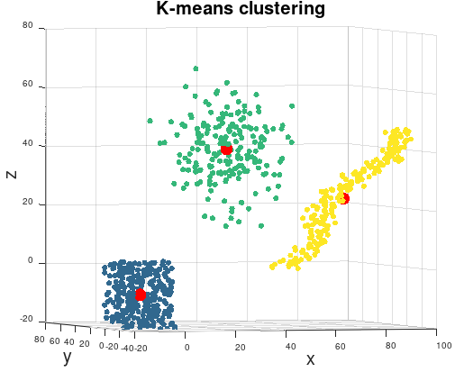

## Kernel Principal Component Analysis
Kernel Principal Component Analysis can be used for dimension reduction and projection on maximum variance between classes.
Kernel methods make PCA suitable for nonlinear data. Kernels has proven very good results in nonlinear dimension reduction.

```matlab
[P, W] = mi.kpca(X, c, kernel_type, kernel_parameters);
```
## Kernel Principal Component Analysis example

https://github.com/DanielMartensson/MataveID/blob/e4274ae4deae4967aadb6917766a9b04d77b4cd7/examples/kpcaExample.m#L1-L62


# SRA - Stochastic Realization Algorithm
This is an algorithm that can identify a stochastic model from error measurement data.
 

 
```matlab
[sysd, K] = mi.sra(e, k, sampleTime, ktune, delay, systemorder);
```

## Example SRA 1
https://github.com/DanielMartensson/MataveID/blob/72c26ea37ecec3e7214750423c42074e3b598bff/examples/sraExample1.m#L1-L52


## Example SRA 2
https://github.com/DanielMartensson/MataveID/blob/2014b74a0863729b43e0ee02ecdcd4fcbc06b26b/examples/sraExample2.m#L1-L35


## Local Binary Pattern
Use LBP if you want to find a binary pattern inside of a matrix, or an image `X` around a pixel `P = X(y, x)`

```matlab
[descriptor] = mi.lbp(X, x, y, radius, init_angle, lbp_bit);
```

## Example

https://github.com/DanielMartensson/MataveID/blob/2e81144d45dd2e77096cdd2846457709038cd429/examples/lbpExample.m#L1-L21

## Result

```matlab
288882440 = 0b10001001101111111111100001000
```

## Linear Discriminant Analysis
Linear Discriminant Analysis can be used for dimension reduction and projection on maximum distance between classes.

```matlab
[P, W] = mi.lda(X, y, c);
```
## Linear Discriminant Analysis example
https://github.com/DanielMartensson/MataveID/blob/74506ea62acf093e7cb14342dbed70b3c6e531fa/examples/ldaExample.m#L1-L70


## Logistic regression
Use this if you have a binary output (0, 1) or (-1, 1) and you want to to have a probabilistic output e.g 0 to 100%

```matlab
[a, b, flag, iterations] = mi.logreg(x, y, function_type)
```

## Example logreg
https://github.com/DanielMartensson/MataveID/blob/351d612fadf5af060b929124ad32da3eb07735ff/examples/logregExample.m#L1-L29


## Linear Support Vector Machine
This is the standard way to create a support vector machine. Even if it's only returning back a linear model, it's still very powerful and suits systems that need extreamly fast predictions such as embedded systems. 

Notice that the Linear Support Vector Machine can only do two-class prediction only. But you can use multiple classes with the Linear Support Vector Machine by using multiple linear support vector machines. It's called One-VS-All method.

```matlab
[w, b, accuracy, solution] = mi.lsvm(x, y, C, lambda)
```

## Linear Support Vector Machine 2D example 

https://github.com/DanielMartensson/MataveID/blob/817443d34f783f393d8265c8b8c5cf0642ebda93/examples/lsvm2DExample.m#L1-L59


### Linear Support Vector Machine 3D example 
https://github.com/DanielMartensson/MataveID/blob/817443d34f783f393d8265c8b8c5cf0642ebda93/examples/lsvm3DExample.m#L1-L57


## Linear Support Vector Machine 9D example

This example demonstrates how to use more than 3 columns in SVM. Notice that here we don't plot this 9D measurements

https://github.com/DanielMartensson/MataveID/blob/b35c7ca9e7a84724e9fc9dc86a1a79583e1472ae/examples/lsvmXDExample.m#L1-L45

## Nonlinear Support Vector Machine with C code generation
This algorithm can do C code generation for nonlinear models. It's a very simple algorithm because the user set out the support points by using the mouse pointer. When all the supports are set ut, then the algorithm will generate C code for you so you can apply the SVM model in pure C code using CControl library. 

All you need to have is two matrices, `X` and `Y`. Where the column length is the data and the row length is the amount of classes.
The `nlsvm.m` file will plot your data and then when you have placed out your support points, then the `svm.m` will generate C code for you that contains all the support points.

If you have let's say more than two variables, e.g `Z` matrix or even more. Then you can create multiple models as well by just using diffrent data as arguments for the `svm` function below. The C code generation is very fast and it's very easy to build a model. 

```matlab
[X_point, Y_point, amount_of_supports_for_class] = mi.nlsvm(X, Y)
```

## Nonlinear Support Vector Machine with C code generation example
https://github.com/DanielMartensson/MataveID/blob/817443d34f783f393d8265c8b8c5cf0642ebda93/examples/nlsvmExample.m#L1-L54


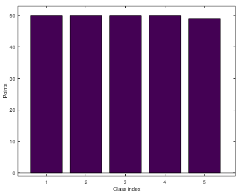

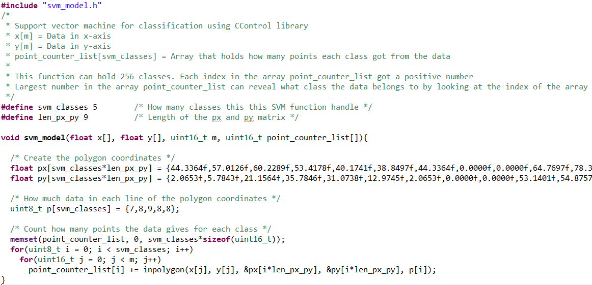

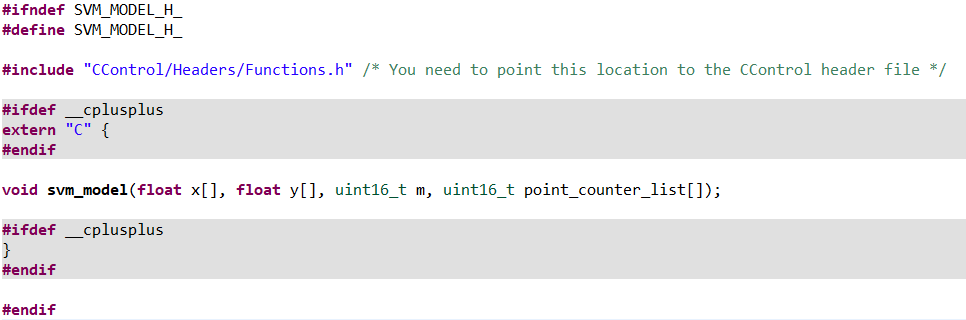

Here is an application with SVM for a hydraulical system. This little box explains whats happening inside the hydraulical system if something happen e.g 
a motor or a valve is active. It can identify the state of the system.


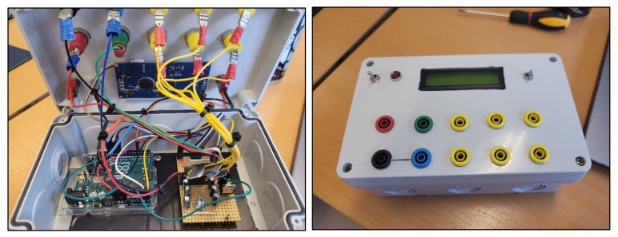

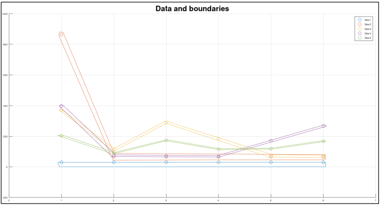

# NN - Neural Network
This generates a neural network back and an activation function.
This Neural Network is tranied by Support Vector Machine.

```matlab
[weight, bias, activation_function] = mi.nn(data, class_id, C, lambda);
```

## Example
Here I'm using Fisher's Irish dataset to train a neural network.
https://github.com/DanielMartensson/MataveID/blob/30c4904c85bb14352724aca1827da023d52950b5/examples/nnExample.m#L1-L29

Output:
```matlab
Training: Neural Network success with accuracy: 1.000000 at class: 1
Training: Neural Network success with accuracy: 0.733333 at class: 2
Training: Neural Network success with accuracy: 0.986667 at class: 3
The accuracy of this model is: 96.6667
```

## Robust Principal Component Analysis
Robust principal component analysis(RPCA) is a great tool if you want to separate noise from data `X` into a matrix `S`. `RPCA` is a better tool than `PCA` because it using optimization and not only reconstructing the image using `SVD`, which `PCA` only does.

```matlab
[L, S] = rpca(X);
```
## Robust Principal Component Analysis example

https://github.com/DanielMartensson/MataveID/blob/2014b74a0863729b43e0ee02ecdcd4fcbc06b26b/examples/rpcaExample.m#L1-L13

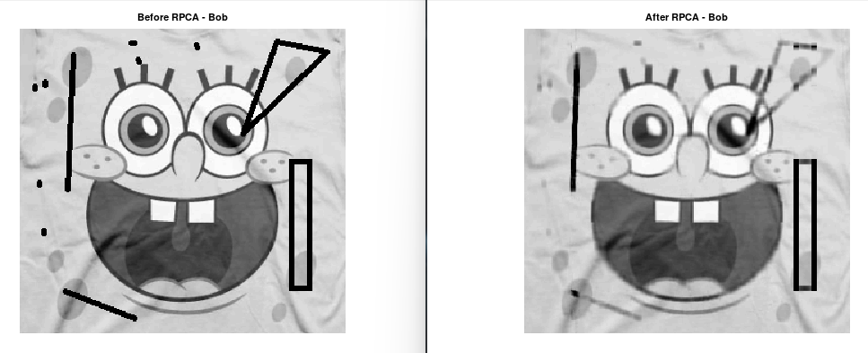


# Install
To install MataveID, download the folder "matave" and place it where you want it. Then the following code need to be written inside of the terminal of your MATLAB® or GNU Octave program. 

```matlab
path('path/to/the/folder/matave', path)
savepath
```
Example of a typical path.

```matlab
path('C:\Users\dmn\Documents\Octave\matave\', path)
savepath
```

Package requriments: 

 - [MataveControl](https://github.com/DanielMartensson/matavecontrol) package.

# Update
Write this inside the terminal. Then MataveID is going to download new .m files to MataveID from GitHub

```matlab
mi.updatemataveid
```
