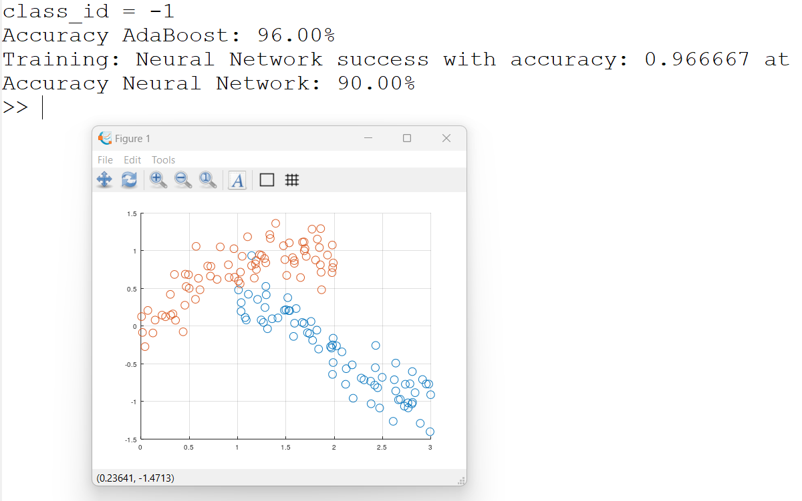

# AdaBoost
AdaBoost is a simple algorithm for doing nonlinear binary classification with weak learners. The weak lerners in this AdaBoost algorithm is Decision Stumps.
AdaBoost is not always more accurate compared to neural netorks or support vector machines, but AdaBoost with Decision Stumps are one of the fastest algorithms
to do prediction with because they are not requried to need linear algebra for matrix multiplications.

```matlab
[models, accuracy, activation_function] = mi.adaboost(X_train, X_test, y_train, y_test, N);
```

## Example
https://github.com/DanielMartensson/MataveID/blob/4ace2f8ce81bdb7cf6176503992c68f1591beff7/examples/adaboostExample.m#L1-L74

## Results

