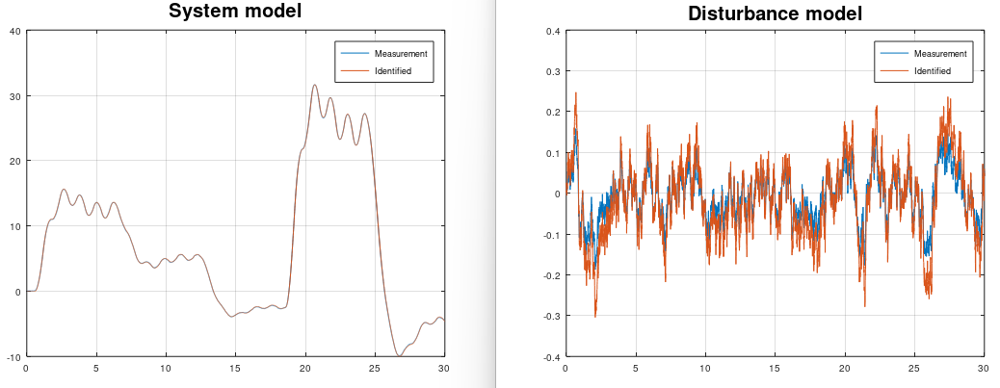

# BJ - Box-Jenkins
Box-Jenkins is a special case when a system model `sysd` and a disturbance model `sysh` need to be found. The disturbance is difficult to know and with this Box-Jenkins algorithm, then the user can identify the disturbance model and create an observer of it by using the kalman gain matrices `K1, K2`. Notice that this Box-Jenkins algorithm using subspace methods, instead of classical polynomial methods.

The disturbance model can be used for:
* Create a disturbance simulation with feedback control 
* Create filtering for sensors

```matlab
[sysd, K1, sysh, K2] = mi.bj(u, y, k, sampleTime, ktune, delay, systemorder_sysd, systemorder_sysh);
```

## Example
https://github.com/DanielMartensson/MataveID/blob/328f7f5cb3a0ad32619968d9babb3126772c4ca3/examples/bjExample.m#L1-L50


## Results

