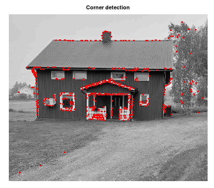
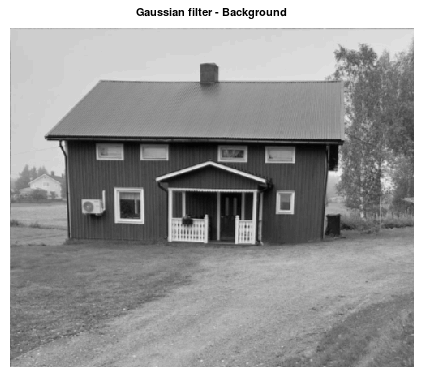
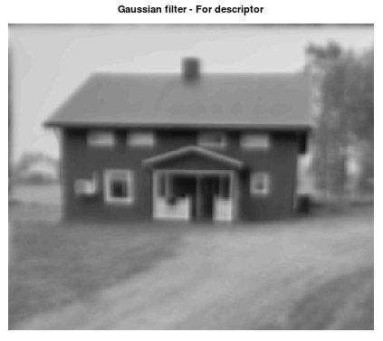
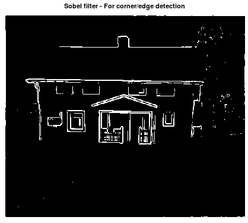

# Binary Robust Invariant Scalable Keypoints
Use this algorithm if you want to convert keypoints into one large histogram for image classification and detection.

```matlab
[data, X1, X2, G, corners, scores] = mi.brisk(X, sigma1, sigma2, threshold_sobel, threshold_fast, fast_method);
```

## Example

https://github.com/DanielMartensson/MataveID/blob/8344dcad56a89355b9ff469c56c6258db5f66973/examples/briskExample.m#L1-L37

## Results








