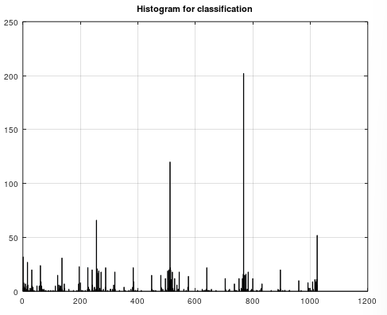

# Binary Robust Invariant Scalable Keypoints
Use this algorithm if you want to convert keypoints into one large histogram for image classification and detection.

```matlab
[histogram, X1, X2, G, corners, scores] = mi.brisk(X, sigma1, sigma2, threshold_sobel, threshold_fast, fast_method);
```

## Example

https://github.com/DanielMartensson/MataveID/blob/c2fc1672220b18a453bd1a3d773251e2d74ab68c/examples/briskExample.m#L1-L40

## Result



