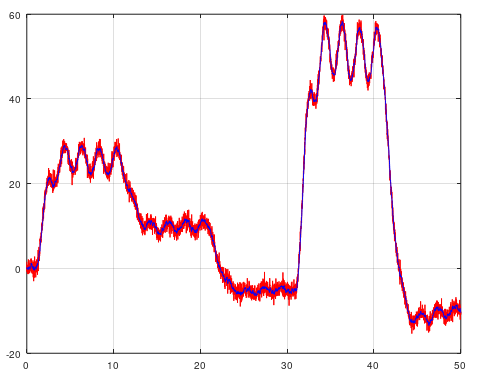

# CCA - Canonical Correlation Analysis
If N4SID won't work for you due to high noise measurement, then CCA is an alternative method to use. CCA returns a state space model and a kalman gain matrix K.

```matlab
[sysd, K] = mi.cca(u, y, k, sampleTime, delay); % k = Integer tuning parameter such as 10, 20, 25, 32, 47 etc.
```

## Example CCA
https://github.com/DanielMartensson/MataveID/blob/2014b74a0863729b43e0ee02ecdcd4fcbc06b26b/examples/ccaExample.m#L1C1-L38

