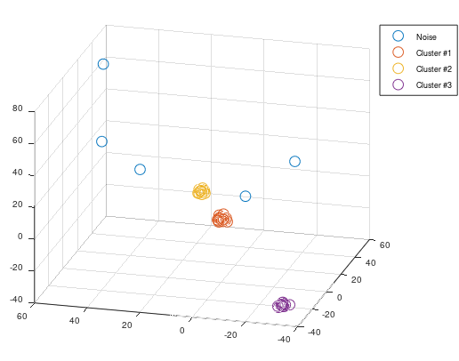
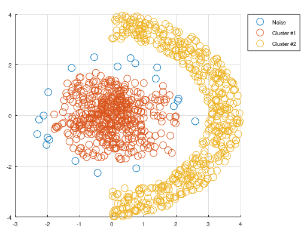

# Density-based spatial clustering of applications with noise
This is a cluster algorithm that can identify the amount of clusters. 
This algorithm requries two tuning parameters, `epsilon` and `min_pts`, which stands for `radius` and `minimum points`.
This algorithm does not work if you have varying densities, else this algorithm is considered to be one of the best clustering algorithms.
So, make sure that all your classes have the same amount of variance before you are using this algorithm due to its robustness against noise/outliers.

It exist an equivalent C-code dbscan inside CControl repository. 

```matlab
[idx] = mi.dbscan(X, epsilon, min_pts);
```

# Example Density-based spatial clustering of applications with noise

https://github.com/DanielMartensson/MataveID/blob/7e1b828a4782826489139ea46defd12bec4c7c38/examples/dbscanExample.m#L1-L110

https://github.com/DanielMartensson/MataveID/blob/837fe5aa302134e3e68631e306ff2ef1ed683281/examples/dbscanNonGaussianExample.m#L1-L1035

## Results




