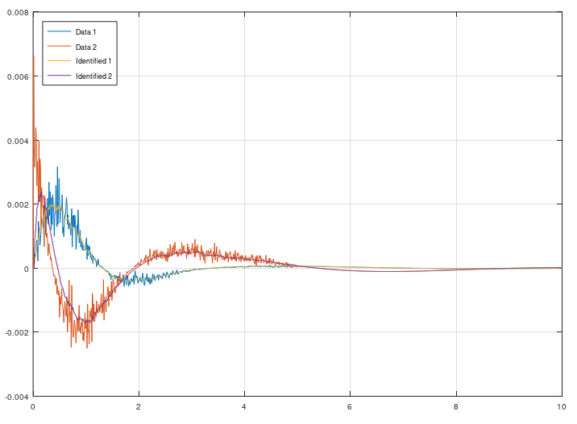

# ERA/DC - Eigensystem Realization Algorithm Data Correlations
ERA/DC was invented 1987 and is a successor from ERA, that was invented 1985 at NASA. The difference between ERA/DC and ERA is that ERA/DC can handle noise much better than ERA. But both algorihtm works as the same. ERA/DC want an impulse response. e.g called markov parameters. You will get a state space model from this algorithm. This algorithm can handle both SISO and MISO data.

Use this algorithm if you got impulse data from e.g structural mechanics.

```matlab
[sysd, K] = mi.eradc(g, sampleTime, ktune, delay systemorder);
```
## Example ERA/DC for MIMO systems


https://github.com/DanielMartensson/MataveID/blob/2014b74a0863729b43e0ee02ecdcd4fcbc06b26b/examples/eradcExample.m#L1-L61

