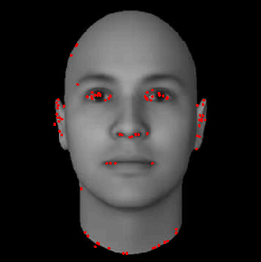

# FAST
Use FAST if you want to find corners inside an image. There is also an equivalent C-code FAST algorithm inside the CControl repository.

```matlab
[corners, scores] = mi.fast(image, threshold, fast_method);
```

## Example
https://github.com/DanielMartensson/MataveID/blob/cbd69aeeb143e64511fed1c1db720d16c5ee92b1/examples/fastExample.m#L1-20

## Result

