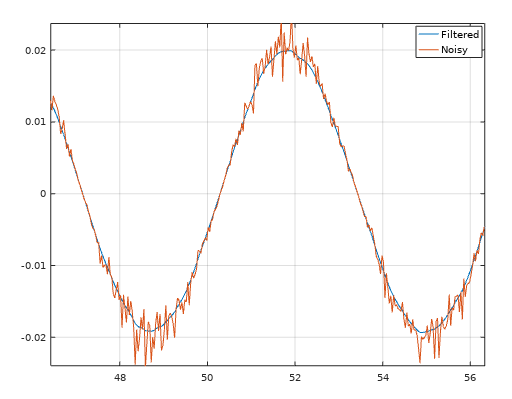

# Filtfilt - Zero Phase Filter
This filter away noise with a good old low pass filter that are being runned twice. Filtfilt is equal to the famous function filtfilt in MATLAB, but this is a regular .m file and not a C/C++ subroutine. Easy to use and recommended. 

```matlab
[y] = mi.filtfilt(y, t, K);
```

## Filtfilt Example
https://github.com/DanielMartensson/MataveID/blob/2014b74a0863729b43e0ee02ecdcd4fcbc06b26b/examples/filtfiltExample.m#L1-L31

