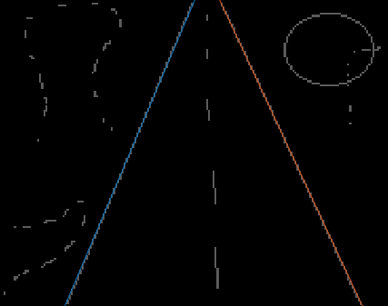

# Hough Transform
Use this algorithm if you want to find lines inside an edge image. Important that the image needs to be an edge image. 

```matlab
[N, K, M, R, T] = mi.hough(X, p, epsilon, min_pts);
```

## Hough Transform example

https://github.com/DanielMartensson/MataveID/blob/6852df845e62f6a46dd99c732e086759e5fd21f7/examples/houghExample.m#L1-L29


