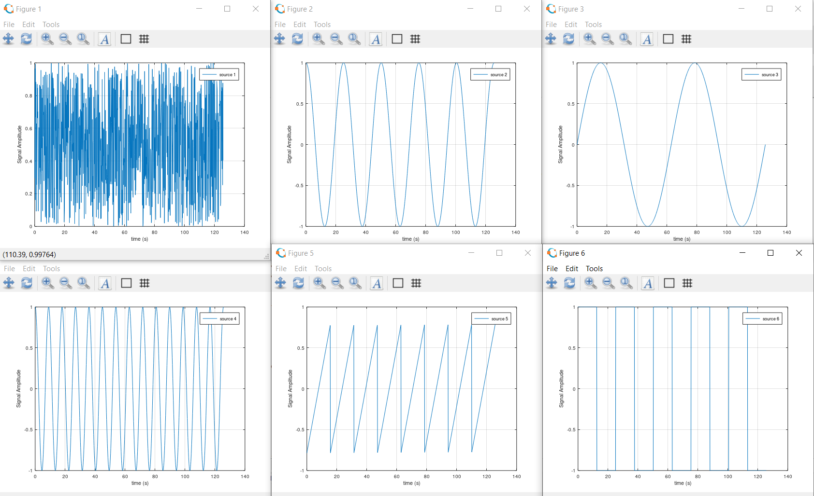

# Independent Component Analysis
Independent component analysis(ICA) is a tool if you want to separate independent signals from each other. This is not a filter algorithm, but instead of removing noise, it separate the disturbances from the signals. The disturbances are created from other signals. Assume that you have an engine and you are measuring vibration in X, Y and Z-axis. These axis will affect each other and therefore the signals will act like they are mixed. ICA separate the mixed signals into clean and independent signals.

```matlab
[S] = mi.ica(X);
```
## Independent Component Analysis example

https://github.com/DanielMartensson/MataveID/blob/2014b74a0863729b43e0ee02ecdcd4fcbc06b26b/examples/icaExample.m#L1-L137

These signals are what we want to find



This is how the signals look when we are measuring them


This is how the signals are reconstructed as they were independent

