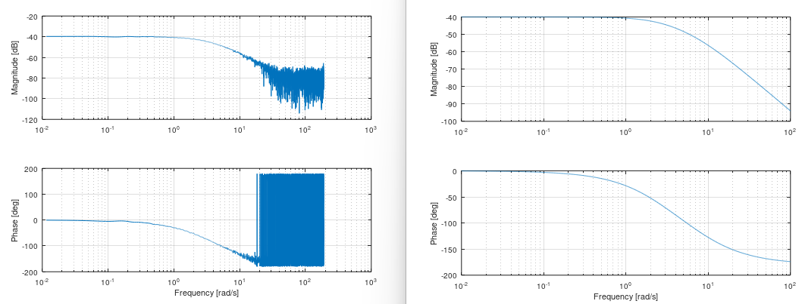

# IDBode - Identification Bode
This plots a bode diagram from measurement data. It can be very interesting to see how the amplitudes between input and output behaves over frequencies. This can be used to confirm if your estimated model is good or bad by using the `bode` command from Matavecontrol and compare it with idebode.

```matlab
mi.idbode(u, y, w);
```

## IDBode Example


https://github.com/DanielMartensson/MataveID/blob/2014b74a0863729b43e0ee02ecdcd4fcbc06b26b/examples/idbodeExample.m#L1-L25

