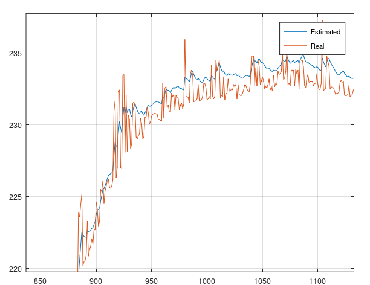

# Kalman Filter
Kalman Filter is the linear verison of the Kalman Filter. It's many of them, but this one is for linear system. Use this if you find UKF or other filter unstable. 
The linear Kalman Filter is most used for control engineering where numerical stabiblity is a high prioritoy issue.

```matlab
[xhat] = mi.kf(sys, u, y, Q, R);
```

## Example
https://github.com/DanielMartensson/MataveID/blob/09f1480836a78593e99af14b6a9d54eaa7c89d5b/examples/kfExample.m#L1-L35

## Results

