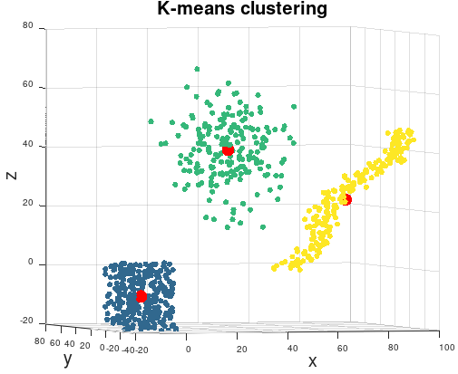

# K-means clustering
K-means clustering is a tool that can identify the center of clusters. All you need to do is to specify how many cluster IDs you think there exist in your data. Use this algorithm if your data is gaussian and you know the numbers of clusters. All you want to know are the cetrums of the clusters.

```matlab
[idx, C] = mi.kmeans(X, k);
```

## K-means clustering example
https://github.com/DanielMartensson/MataveID/blob/2014b74a0863729b43e0ee02ecdcd4fcbc06b26b/examples/kmeansExample.m#L1-L26



