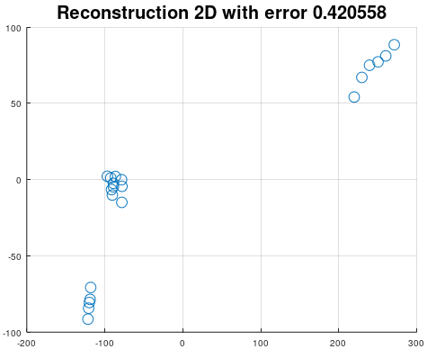

# Kernel Principal Component Analysis
Kernel Principal Component Analysis can be used for dimension reduction and projection on maximum variance between classes.
Kernel methods make PCA suitable for nonlinear data. Kernels has proven very good results in nonlinear dimension reduction.

```matlab
[K, P, W, mu] = mi.kpca(X, c, kernel_type, kernel_parameters);
```
## Kernel Principal Component Analysis example

https://github.com/DanielMartensson/MataveID/blob/fd734161b93d9d4a1e24c87a4ecf1d3e0b644c47/examples/kpcaExample.m#L1-L62



