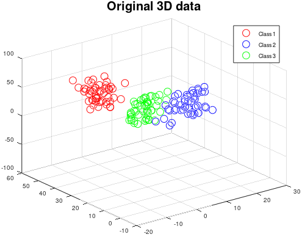

# Linear Discriminant Analysis
Linear Discriminant Analysis can be used for dimension reduction and projection on maximum distance between classes.

```matlab
[P, W] = mi.lda(X, y, c);
```
## Linear Discriminant Analysis example
https://github.com/DanielMartensson/MataveID/blob/74506ea62acf093e7cb14342dbed70b3c6e531fa/examples/ldaExample.m#L1-L70




