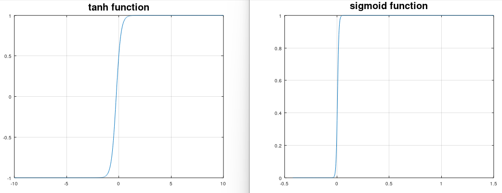

# logreg - Logistic regression
Use this if you have a binary output (0, 1) or (-1, 1) and you want to to have a probabilistic output e.g 0 to 100%

```matlab
[a, b, flag, iterations] = mi.logreg(x, y, function_type)
```

## Example logreg
https://github.com/DanielMartensson/MataveID/blob/8d119f00048708e4e8dfca5d15b4718d525afd43/examples/logregExample.m#L1-L29


