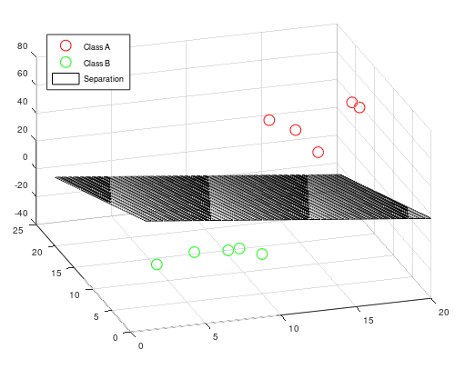

# Linear Support Vector Machine
This is the standard way to create a support vector machine. Even if it's only returning back a linear model, it's still very powerful and suits systems that need extreamly fast predictions such as embedded systems. 

Notice that the Linear Support Vector Machine can only do two-class prediction only. But you can use multiple classes with the Linear Support Vector Machine by using multiple linear support vector machines. It's called One-VS-All method.

```matlab
[w, b, accuracy, solution] = mi.lsvm(x, y, C, lambda)
```

## Linear Support Vector Machine 2D example 

https://github.com/DanielMartensson/MataveID/blob/817443d34f783f393d8265c8b8c5cf0642ebda93/examples/lsvm2DExample.m#L1-L59


### Linear Support Vector Machine 3D example 
https://github.com/DanielMartensson/MataveID/blob/817443d34f783f393d8265c8b8c5cf0642ebda93/examples/lsvm3DExample.m#L1-L57



## Linear Support Vector Machine 9D example

This example demonstrates how to use more than 3 columns in SVM. Notice that here we don't plot this 9D measurements

https://github.com/DanielMartensson/MataveID/blob/b35c7ca9e7a84724e9fc9dc86a1a79583e1472ae/examples/lsvmXDExample.m#L1-L45
