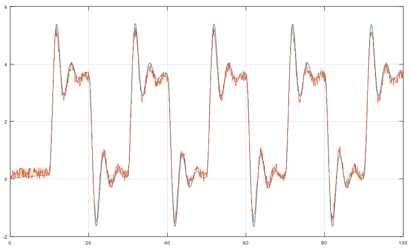

# MOESP - Multivariable Output-Error State Space
MOESP is an algorithm that identify a linear state space model. It was invented in 1992. It can both identify SISO and MISO models.
Try MOESP or N4SID. They give the same result, but sometimes MOESP can be better than N4SID. It all depends on the data.

```matlab
[sysd] = mi.moesp(u, y, k, sampleTime, delay, systemorder); % k = Integer tuning parameter such as 10, 20, 25, 32, 47 etc.
```

## Example MOESP
https://github.com/DanielMartensson/MataveID/blob/39c9b1b9d4361b880f1773b82764bd549c943f5d/examples/moespExample.m#L1-L22

