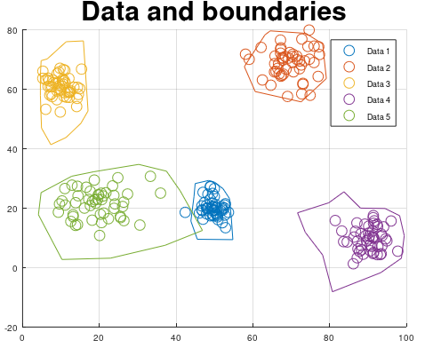

# Nonlinear Support Vector Machine with C code generation
This algorithm can do C code generation for nonlinear models. It's a very simple algorithm because the user set out the support points by using the mouse pointer. When all the supports are set ut, then the algorithm will generate C code for you so you can apply the SVM model in pure C code using CControl library. 

All you need to have is two matrices, `X` and `Y`. Where the column length is the data and the row length is the amount of classes.
The `nlsvm.m` file will plot your data and then when you have placed out your support points, then the `svm.m` will generate C code for you that contains all the support points.

If you have let's say more than two variables, e.g `Z` matrix or even more. Then you can create multiple models as well by just using diffrent data as arguments for the `svm` function below. The C code generation is very fast and it's very easy to build a model. 

```matlab
[X_point, Y_point, amount_of_supports_for_class] = mi.nlsvm(X, Y)
```

## Nonlinear Support Vector Machine with C code generation example
https://github.com/DanielMartensson/MataveID/blob/817443d34f783f393d8265c8b8c5cf0642ebda93/examples/nlsvmExample.m#L1C1-L54




Here is an application with SVM for a hydraulical system. This little box explains whats happening inside the hydraulical system if something happen e.g 
a motor or a valve is active. It can identify the state of the system.


