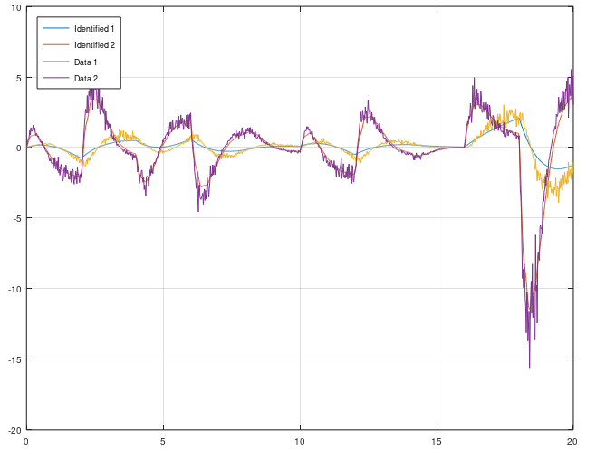

# OCID - Observer Controller Identification
This is an extention from OKID. The idea is the same, but OCID creates a LQR contol law as well. This algorithm works only for closed loop data. It have its orgin from NASA around 1992 when NASA wanted to identify a observer, model and a LQR control law from closed loop data that comes from an actively controlled aircraft wing in a wind tunnel at NASA Langley Research Center. This algorithm works for both SISO and MIMO models.

Use this algorithm if you want to extract a LQR control law, kalman observer and model from a running dynamical system. Or if your open loop system is unstable and it requries some kind of feedback to stabilize it. Then OCID is the perfect choice.

This OCID algorithm have a particle filter that estimates the markov parameters.

```matlab
[sysd, K, L] = mi.ocid(r, uf, y, sampleTime, alpha, regularization, systemorder);
```


## OCID Example
https://github.com/DanielMartensson/MataveID/blob/2014b74a0863729b43e0ee02ecdcd4fcbc06b26b/examples/ocidExample.m#L1-L59


