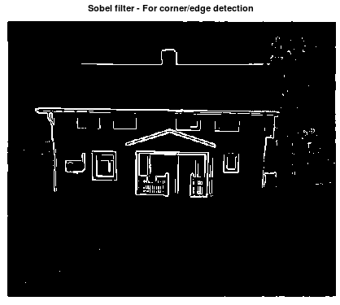

# Oriented FAST Rotated Pattern
Use this algorithm if you want to convert keypoints into one large binary matrix for image classification and detection.

```matlab
[data, X1, X2, G, corners, scores] = mi.orp(X, sigma1, sigma2, threshold_sobel, threshold_fast, fast_method);
```

## Example

https://github.com/DanielMartensson/MataveID/blob/a300c9e3507cb9806b9b5ff59770ca02eee9a0bb/examples/briskExample.m#L1-L37

## Results



