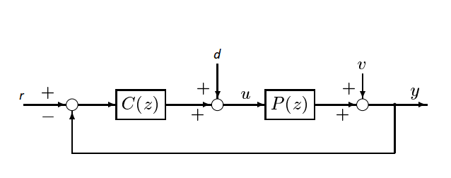

### Orthogonal Decomposition of Joint Input-Output Process
This algorithm identify the closed loop system, plant and controller. The difference between OCID and Orthogonal Decomposition of Joint Input-Output Process (ORTJIOP) is that OCID identifies the plant model, LQR control law and kalman gain matrix. The ORTJIOP identifies the closed loop system, plant model and controller. But not LQR controller. Instead, ORTJIOP returns the controller as it was a dynamical model. ORTJIOP can have disturbance onto the input system of the plant as well.



```matlab
[sysd, P, C] = mi.ortjiop(u, y, r, d, k, sampleTime, delay, systemorder);
```

## Orthogonal Decomposition of Joint Input-Output Process example

```matlab
% Will upload soon a practical example with real measurements
```