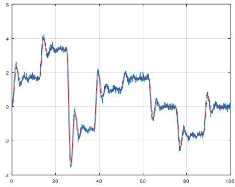

# Particle Filter - Nonlinear filter
A particle filter is another estimation filter such as Square Root Uncented Kalman Filter (SR-UKF), but SR-UKF assume that the noise is gaussian (normally distributed) and SR-UKF requries a dynamical model. The particle filter does not require the user to specify a dynamical model and the particle filter assume that the noise can be non-gaussian or gaussian, nonlinear in other words.

The particle filter is using Kernel Density Estimation algorithm to create the internal probability model, hence the user only need to specify one parameter with the following example. If you don't have a model that describes the dynamical behaviour, this filter is the right choice for you then.

```matlab
[xhat, horizon, k, noise] = mi.pf(x, xhatp, k, horizon, noise);
```

## Particle Filter example 1
https://github.com/DanielMartensson/MataveID/blob/817443d34f783f393d8265c8b8c5cf0642ebda93/examples/particleFilterExample1.m#L1-L44



## Particle Filter example 2
https://github.com/DanielMartensson/MataveID/blob/817443d34f783f393d8265c8b8c5cf0642ebda93/examples/particleFilterExample2.m#L1-L32

