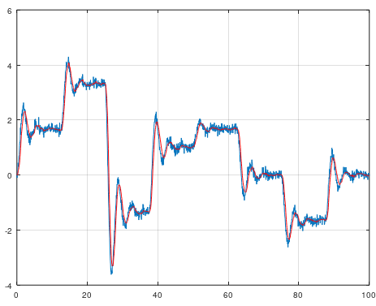

# Particle Filter - Nonlinear filter
A particle filter is another estimation filter such as Square Root Uncented Kalman Filter (SR-UKF), but SR-UKF assume that the noise is gaussian (normally distributed) and SR-UKF requries a dynamical model. The particle filter does not require the user to specify a dynamical model and the particle filter assume that the noise can be non-gaussian or gaussian, nonlinear in other words.

The particle filter is using Kernel Density Estimation algorithm to create the internal probability model, hence the user only need to specify one parameter with the following example. If you don't have a model that describes the dynamical behaviour, this filter is the right choice for you then.

```matlab
[xhat, horizon, k, noise] = mi.pf(x, xhatp, k, horizon, noise);
```

## Particle Filter example 1
```matlab
clc; clear; close all;

% Create inputs
N = 200;
u = linspace(1, 1, N);
u = [5*u 10*u -4*u 3*u 5*u 0*u -5*u 0*u];

% Create time
t = linspace(0, 100, length(u));

% Create second order model
G = mc.tf(1, [1 0.8 3]);

% Simulate outputs
y = mc.lsim(G, u, t);
close

% Add noise
e = 0.1*randn(1, length(u));
y = y + e;

% Do particle filtering - Tuning parameters
p = 4;                            % Length of the horizon (Change this)

% Particle filter - No tuning
[m, n] = size(y);                  % Dimension of the output state and length n
yf = zeros(m, n);                  % Filtered outputs
horizon = zeros(m, p);             % Horizon matrix
xhatp = zeros(m, 1);               % Past estimated state
xhatp(1) = y(1);                   % First estimation is a real measurement
k = 1;                             % Horizon counting (will be counted to p. Do not change this)
noise = rand(m, p);                % Random noise, not normal distributed

% Particle filter - Simulation
for i = 1:n
  x = y(:, i);                     % Get the state
  [xhat, horizon, k, noise] = mi.pf(x, xhatp, k, horizon, noise);
  yf(:, i) = xhat;                 % Estimated state
  xhatp = xhat;                    % This is the past estimated state
end

% Plot restult
plot(t, y, t, yf, '-r')
grid on
```



## Particle Filter example 2
```matlab
clc; clear; close all;

file = fullfile('..','data','ParticleFilterDataRaw.csv');
X = dlmread(file,';',1,0);
t = X(:, 1)';
y = X(:, 2)';

% Do particle filtering - Tuning parameters
p = 14;                            % Length of the horizon (Change this)

% Particle filter - No tuning
[m, n] = size(y);                  % Dimension of the output state and length n
yf = zeros(m, n);                  % Filtered outputs
horizon = zeros(m, p);             % Horizon matrix
xhatp = zeros(m, 1);               % Past estimated state
xhatp(1) = y(1);                   % First estimation is a real measurement
k = 1;                             % Horizon counting (will be counted to p. Do not change this)
noise = rand(m, p);                % Random noise, not normal distributed

% Particle filter - Simulation
for i = 1:n
  x = y(:, i);                     % Get the state
  [xhat, horizon, k, noise] = mi.pf(x, xhatp, k, horizon, noise);
  yf(:, i) = xhat;                 % Estimated state
  xhatp = xhat;                    % This is the past estimated state
end

% Plot restult
plot(t, y)
hold on
plot(t, yf, '-r')
grid on
```

