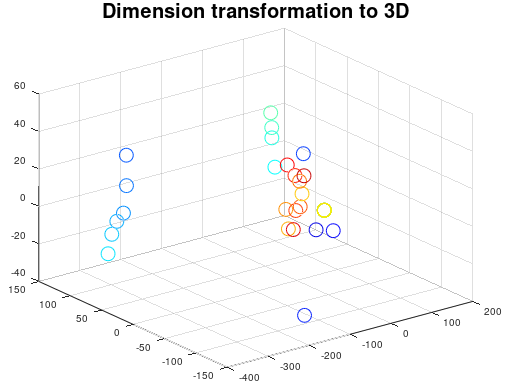
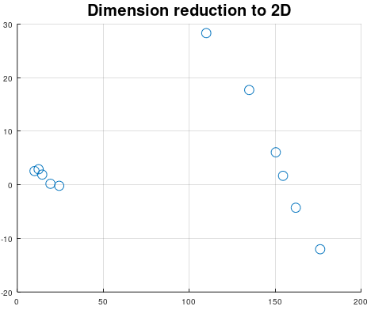
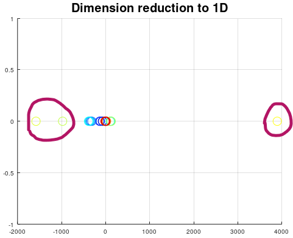

# Principal Component Analysis
Principal Component Analysis can be used for dimension reduction and projection on maximum variance between classes.
This PCA algorithm has a very smart method to remove outliers. The method is using L2-norm and sorting to detect outliers. The PCA algorithm also compute 
how many points can a the data be defined as a cluster.

```matlab
[P, W] = mi.pca(X, c);
```
## Principal Component Analysis example

https://github.com/DanielMartensson/MataveID/blob/2014b74a0863729b43e0ee02ecdcd4fcbc06b26b/examples/pcaExample.m#L1-L59







