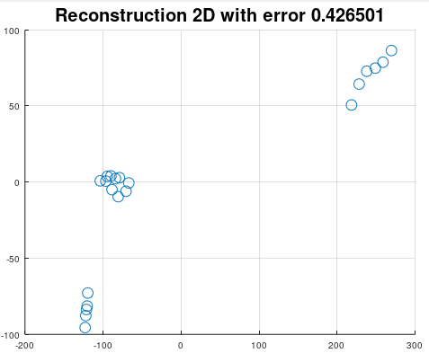

# Principal Component Analysis
Principal Component Analysis can be used for dimension reduction and projection on maximum variance between classes.

```matlab
[P, W, mu] = mi.pca(X, c);
```
## Principal Component Analysis example

https://github.com/DanielMartensson/MataveID/blob/48b6eaf69f061351e910877c131b6d3dde03ff31/examples/pcaExample.m#L1-L60



