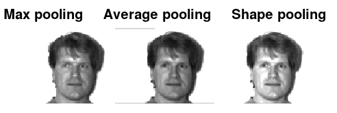

# Pooling
Reduce the pixel size of an image

```matlab
[P] = mi.pooling(image, pooling_method, p);
```

# Example Pooling

https://github.com/DanielMartensson/MataveID/blob/21afd4ac2816d87fd91d5cd153dfed0a0833b88f/examples/poolingExample.m#L1-L21

## Results

