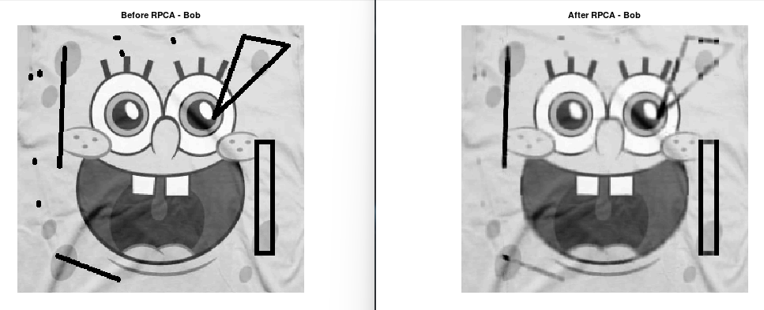

# Robust Principal Component Analysis
Robust principal component analysis(RPCA) is a great tool if you want to separate noise from data `X` into a matrix `S`. `RPCA` is a better tool than `PCA` because it using optimization and not only reconstructing the image using `SVD`, which `PCA` only does.

```matlab
[L, S] = rpca(X);
```
## Robust Principal Component Analysis example

https://github.com/DanielMartensson/MataveID/blob/2014b74a0863729b43e0ee02ecdcd4fcbc06b26b/examples/rpcaExample.m#L1-L13


