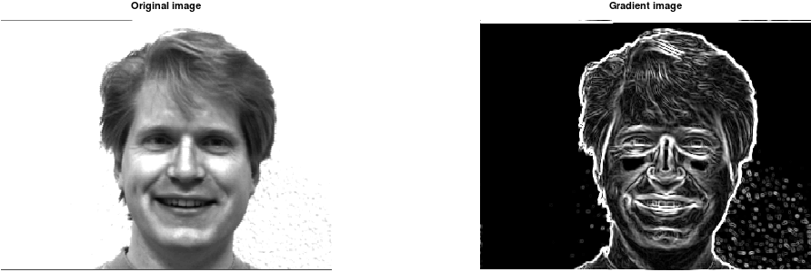

# Sobel filter
Use this filter if you want to find the gradients and the orientations inside an image

```matlab
[G, O] = mi.sobel(image);
```

## Example

https://github.com/DanielMartensson/MataveID/blob/1fb031672ff69d67bdc297795498fef6665263d0/examples/sobelExample.m#L1-L23

## Result

