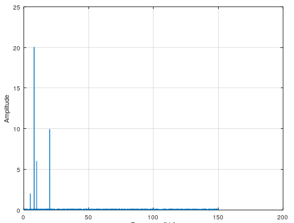

# SPA - Spectral Analysis
This plots all the amplitudes from noisy data over its frequencies. Very good to see what type of noise or signals you have. With this, you can determine what the real frequencies and amplitudes are and therefore you can create your filtered frequency response that are clean.

```matlab
[amp, wout] = mi.spa(y, t);
```

## SPA Example

Assume that we are using the previous example with different parameters.

https://github.com/DanielMartensson/MataveID/blob/2014b74a0863729b43e0ee02ecdcd4fcbc06b26b/examples/spaExample.m#L1-L15



