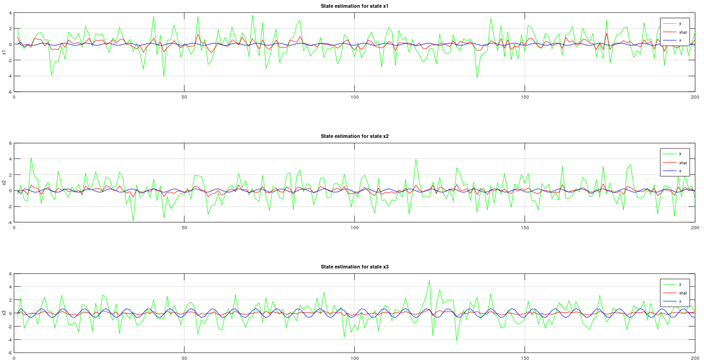

# Square Root Uncented Kalman Filter for state estimation
This is Uncented Kalman Filter that using cholesky update method (more stable), instead of cholesky decomposition. This algorithm can estimate states from a very complex model. This method is reqursive and there is a C code version in CControl as well. Use this when you need to estimate state to a model if you have data that are generated from that function. It can be for example an object that you have measured data and you know the mathematical formula for that object. Use the measured data with this algorithm and find the states for the model.

```matlab
[S, xhat] = mi.sr_ukf_state_estimation(y, xhat, Rn, Rv, u, F, S, alpha, beta, L);
```

## Square Root Uncented Kalman Filter for state estimation example
https://github.com/DanielMartensson/MataveID/blob/2014b74a0863729b43e0ee02ecdcd4fcbc06b26b/examples/sr_ukf_state_estimationExample.m#L1-L68


