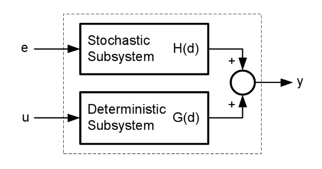
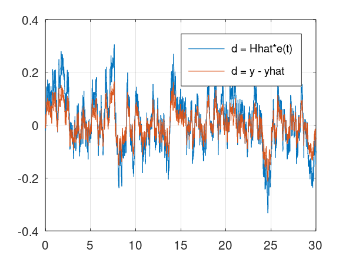
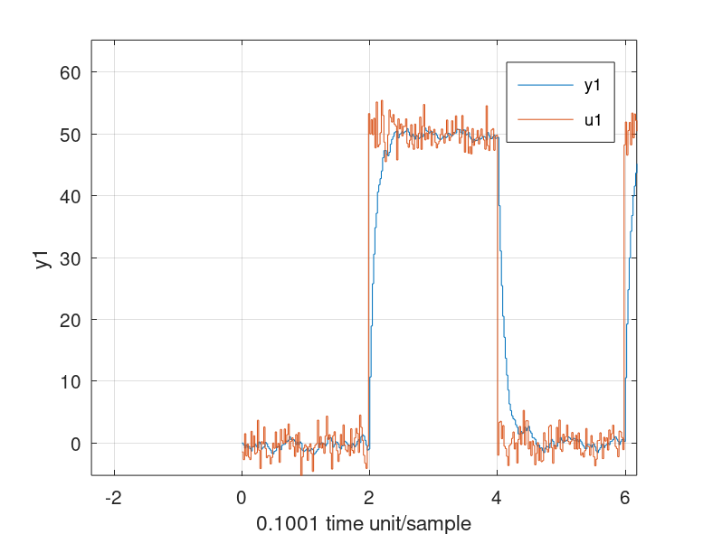

# SRA - Stochastic Realization Algorithm
This is an algorithm that can identify a stochastic model from error measurement data.
 

 
```matlab
[sysd, K] = mi.sra(e, k, sampleTime, ktune, delay, systemorder);
```

## Example SRA 1
https://github.com/DanielMartensson/MataveID/blob/72c26ea37ecec3e7214750423c42074e3b598bff/examples/sraExample1.m#L1-L52



## Example SRA 2
https://github.com/DanielMartensson/MataveID/blob/2014b74a0863729b43e0ee02ecdcd4fcbc06b26b/examples/sraExample2.m#L1-L35




